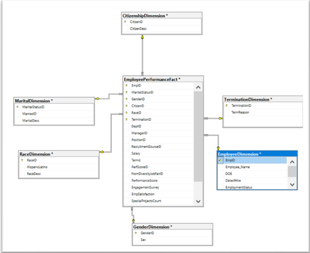
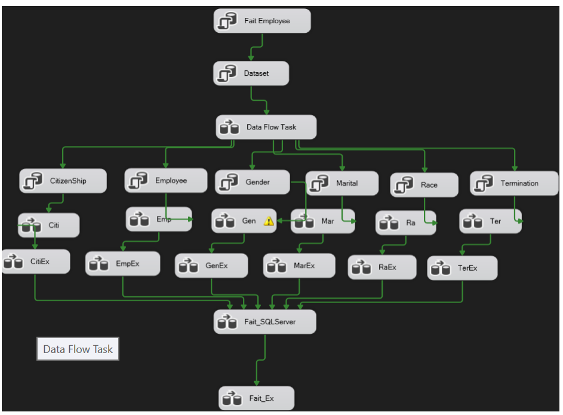

# Analyse des données de ressources humaines

Ce projet consiste en une analyse approfondie des données de ressources humaines en utilisant diverses technologies et outils. Le processus inclut le nettoyage des données avec Python, le transfert des données dans un entrepôt de données via SSIS (ETL), et la création d'un rapport avec Power BI.

## Introduction

Ce projet vise à démontrer une approche complète de l'analyse des données de ressources humaines, depuis le nettoyage des données brutes jusqu'à la visualisation des résultats dans un tableau de bord interactif. Les étapes principales sont :

- Nettoyage des données avec Python.
- Transfert des données nettoyées dans un data warehouse via SSIS.
- Création d'un rapport interactif composé de 3 pages avec Power BI.

## Prérequis

Avant de commencer, assurez-vous d'avoir les logiciels et bibliothèques suivants installés :

- Python 3.x
- Pandas
- NumPy
- Excel
- SQL server Management Studio
- SQL Server Integration Services (SSIS)
- Power BI Desktop
  

## Video
Vous pouvez télécharger et regarder la vidéo de présentation du rapport [ici](Dashboard.mp4).

## Contribution
Les contributions sont les bienvenues ! Veuillez ouvrir une issue ou soumettre une pull request pour toute amélioration ou correction de bug.
## Auteur
[Said KHALID](https://github.com/Said02KHalid) 
